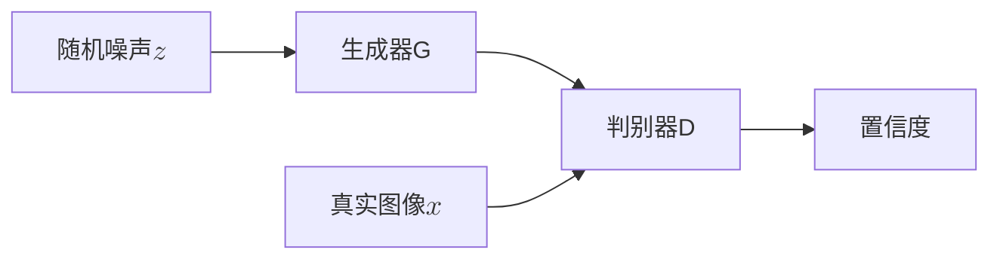
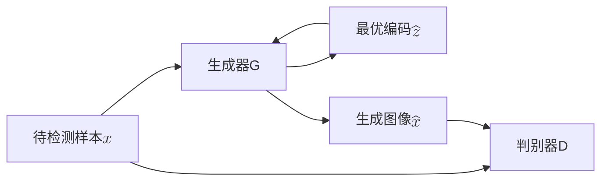

转眼间现在已经2025年了，距离AnoGAN第一次在2017年被提出，到2019年提出f-AnoGAN，已经过去了8年。AnoGAN作为一个基于生成对抗网络（GAN）的异常检测方法，在这几年中得到了广泛的研究和应用。从现在的眼光看f-AnoGAN的效果已经比不上大多数最近的新方法，但是其模型设计理念仍值得我们学习和借鉴。本文主要以f-AnoGAN为引，讲述其设计来源的几个重要模型。

|  年份   | 模型  |
|  ----  | ----  |
| 2014 | GAN |
| 2015 | DCGAN |
| 2017 | AnoGAN、WGAN、WGAN-GP |
| 2018 | GANomaly |
| 2019 | f-AnoGAN |

# DCGAN

## 模型特点
在DCGAN中首次提出了反卷积（Deconvolution，转置卷积）层，这种层可以将低维特征图转换为高维图像。DCGAN还引入了批归一化（Batch Normalization）和ReLU激活函数，使得训练更加稳定。此外，DCGAN使用了全卷积网络结构，避免了全连接层的使用，从而减少了参数数量。

## 训练阶段 

整体结构如上图所示，模型由一个生成器和一个判别器组成。在DCGAN中生成器和判别器都是CNN结构，生成器通过反卷积层将随机噪声$z$转换为图像，而判别器则通过卷积层对输入图像进行分类，判断其是真实图像还是生成图像。

判别器会给出一个置信度值，表示输入图像是真实图像的概率。我们希望真实图像接近1，生成图像接近0，因此优化目标为

$$\underset{G}\min \underset{D}\max  \mathbb{E}_{x \sim p_{data}(x)}[\log D(x)] + \mathbb{E}_{z \sim p_{noise}(z)}[\log(1 - D(G(z)))]$$

在训练时我们先抽取真实图像，在抽取同样数量的随机噪声$z\in N(0,1)$，交替训练生成器G和判别器D直到收敛。

# AnoGAN

## 模型特点
AnoGAN是一个基于GAN的异常检测方法，最早由Schlegl等人在2017年提出。它的核心思想是通过训练一个生成对抗网络（GAN）来学习正常样本的分布，从而能够检测出异常样本。

## 训练阶段

训练阶段跟DCGAN一致，优化的目标函数为

$$\underset{G}\min \underset{D}\max  \mathbb{E}_{x \sim p_{data}(x)}[\log D(x)] + \mathbb{E}_{z \sim p_{noise}(z)}[\log(1 - D(G(z)))]$$

## 测试阶段

对于待检测的样本$x$，我们固定生成器G，使用反向传播得到最合适的编码$\hat z$，使得生成图像$\hat x = G(\hat z)$与原图像$x$之间的差异最小。为了在隐空间上足够接近，设计的损失函数由残差损失和判别损失组成。

残差损失度量了原图$x$和生成图像$G(\hat{x})$的视觉相似性，这里定义为

$$L_{res}(\hat{z}) = ||x - G(\hat{z})||_1$$

对于图像修复，可以将生成图像$G(\hat{x})$丢入判别器使得$D(G(\hat{x}))$尽可能接近1。在这篇文章中，作者通过特征匹配来改进判别损失，这使得生成图像和原图在特征空间上更接近。令$f(\cdot)$为判别器中间层的特征，则判别损失定义为

$$L_{disc}(\hat{z}) = ||f(x) - f(G(\hat{z}))||_1$$

最后我们将两部分损失结合起来，得到最终的优化目标函数

$$L(\hat{z}) = (1-\lambda)L_{res}(\hat{z}) + \lambda L_{disc}(\hat{z})$$

在这篇文章中$\lambda$取了0.1，在通过迭代优化得到最优编码$\hat{z}$后，生成图像$G(\hat{z})$与原图像$x$的差异越大，则认为该样本是异常的。
