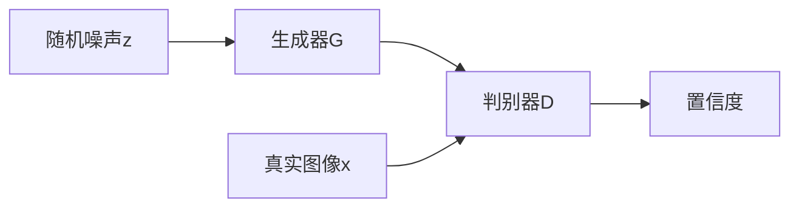

转眼间现在已经2025年了，距离AnoGAN第一次在2017年被提出，到2019年提出f-AnoGAN，已经过去了8年。AnoGAN作为一个基于生成对抗网络（GAN）的异常检测方法，在这几年中得到了广泛的研究和应用。从现在的眼光看f-AnoGAN的效果已经比不上大多数最近的新方法，但是其模型设计理念仍值得我们学习和借鉴。本文主要以f-AnoGAN为引，讲述其设计来源的几个重要模型。

|  年份   | 模型  |
|  ----  | ----  |
| 2014 | GAN |
| 2015 | DCGAN |
| 2017 | AnoGAN、WGAN、WGAN-GP |
| 2019 | f-AnoGAN |

# DCGAN

## 模型特点
在DCGAN中首次提出了反卷积（Deconvolution，转置卷积）层，这种层可以将低维特征图转换为高维图像。DCGAN还引入了批归一化（Batch Normalization）和ReLU激活函数，使得训练更加稳定。此外，DCGAN使用了全卷积网络结构，避免了全连接层的使用，从而减少了参数数量。

## 网络设计

整体结构如上图所示，模型由一个生成器和一个判别器组成。在DCGAN中生成器和判别器都是CNN结构，生成器通过反卷积层将随机噪声$z$转换为图像，而判别器则通过卷积层对输入图像进行分类，判断其是真实图像还是生成图像。

## 训练方法 

判别器会给出一个置信度值，表示输入图像是真实图像的概率。我们希望真实图像接近1，生成图像接近0，因此优化目标为

$$\underset{G}\min \underset{D}\max  \mathbb{E}_{x \sim p_{data}(x)}[\log D(x)] + \mathbb{E}_{z \sim p_{noise}(z)}[\log(1 - D(G(z)))]$$

在训练时我们先抽取真实图像，在抽取同样数量的随机噪声$z\in N(0,1)$，交替训练生成器G和判别器D直到收敛。

# AnoGAN

f-AnoGAN是一个基于GAN的异常检测方法，最早由Schlegl等人在2017年提出。它的核心思想是通过训练一个生成对抗网络（GAN）来学习正常样本的分布，从而能够检测出异常样本。
f-AnoGAN的工作流程如下：
1. **训练阶段**：使用正常样本训练一个GAN模型。生成器学习生成与正常样本相似的图像，而判别器则学习区分真实图像和生成图像。
2. **异常检测阶段**：对于待检测的样本，使用生成器生成与之相似的图像，并计算生成图像与原图像之间的差异。如果差异较大，则认为该样本是异常的。
f-AnoGAN的优点在于它能够处理高维数据，并且不需要对异常样本进行标注。然而，它也有一些局限性，例如对正常样本的分布假设较强，可能导致在某些情况下无法有效检测异常。
f-AnoGAN的前世今生可以追溯到生成对抗网络（GAN）的发展历程。GAN最早由Goodfellow等人在2014年提出，旨在通过对抗训练生成高质量的图像。随着GAN的不断发展，研究者们开始探索其在异常检测等领域的应用。
f-AnoGAN作为GAN在异常检测领域的一个重要应用，标志着GAN技术在计算机视觉和机器学习中的广泛应用。
f-AnoGAN的研究和应用仍在不断发展，许多改进和变体被提出，以提高其性能和适用性。未来，随着深度学习技术的进一步发展，f-AnoGAN及其变体有望在更多实际应用中发挥重要作用。
f-AnoGAN的前世今生可以总结为以下几个方面：
1. **GAN的提出**：2014年，Goodfellow等人提出了生成对抗网络（GAN），开启了生成模型的新纪元。
2. **f-AnoGAN的提出**：2017年，Schlegl等人提出了f-AnoGAN，将GAN应用于异常检测领域，展示了GAN在处理高维数据和异常样本检测方面的潜力。
3. **f-AnoGAN的改进和变体**：随着研究的深入，许多改进和变体被提出，以提高f-AnoGAN的性能和适用性。例如，使用更复杂的生成器和判别器结构，引入自监督学习等技术。
4. **实际应用**：f-AnoGAN及其变体在工业缺陷检测、医学图像分析等领域得到了广泛应用，展示了其在实际问题中的有效性。
f-AnoGAN的前世今生展示了GAN技术在异常检测领域的广泛应用和发展潜力。随着研究的不断深入，f-AnoGAN及其变体有望在更多实际应用中发挥重要作用。
