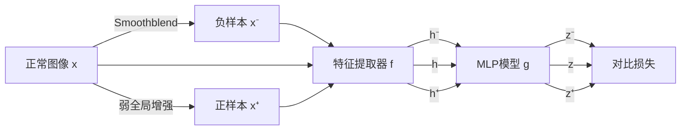

## 模型特点
SPD(SPot-the-difference) 是一个数据增强方案，由Zou等人在2022年提出。文章主要提出了SPD训练方法，和VisA数据集。

## 训练阶段

首先对输入图像 $x$，使用全局增强，例如随机裁剪、高斯模糊、水平反转、颜色抖动，得到弱增强正样本 $x^+$。然后在全局增强的基础上应用smoothblend算法获得负样本 $x^-$，具体是将图像的随机切割块进行颜色抖动，然后高斯模糊，再粘贴到同一图像的随机位置。

然后通过特征提取器 $f$ 得到 $h$、$h^+$、$h^-$，再经过MLP $g$ 得到投影 $z$、$z^+$、$z^-$。我们利用余弦相似度来衡量相关性，于是损失为：

$$
L_{SPD} = \cos(z,z^-) - \cos(z,z^+)
$$

可以将SPD损失直接作为正则项加在常规自监督学习方法里。
