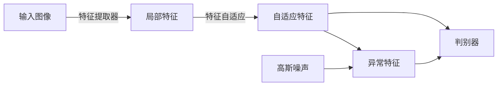

## 模型特点

SimpleNet是一个基于特征分类的无异常检测方法，由Liu等人在2023年提出。SimpleNet使用了一个特征适应器来对齐预训练数据和训练数据，并且利用特征而不是样本来训练判别器，从而有更高的计算效率。

## 训练模型

训练过程由四部分组成：

- 提取特征
- 对齐特征
- 通过对正样本特征加噪声获得负样本特征
- 从特征进行判别

### 特征提取

特征提取部分使用预训练模型，然后参考了patchcore的局部感知patch特征，使用中间层级的特征来减少预训练数据的bias。具体的，先选择层级index $\{l\}$，然后计算每张图 $x_i$ 在 $l$ 的局部patch特征：

$$z^{l,i}(h,w) = f_{agg}(\{\phi_{i,l}(a,b)|(a,b)\in\mathcal{N}_p^{(h,w)}\})$$

再统一线性插值到 $(H_0,W_0)$ 大小得到 $o^{l,i}$。然后cat全部 $l$ 层得到 $o^i$：

$$o^i=cat(resize(z^{l',i},(H_0,W_0)))|l'\in L$$

### 特征适应

特征适应部分使用了一个MLP，经过实验单层全连接层 $G_\theta$ 已经有足够好的效果：

$$q^i=G_\theta(o^i)$$

### 异常特征生成

通过给对齐后的特征 $q^i$ 加上噪声来生成异常特征 $q^{i-}$，令 $\epsilon$ 为高斯噪声，则异常特征为：

$$q^{i-}=q^{i}+\epsilon$$

### 判别器训练

判别器 $D_\psi$ 使用了2层MLP，不同于一般GAN模型使用的交叉熵，这里使用了截断 $l_1$ 损失：

$$L^i=\max(0,0.5-D_\psi(q^i))+\max(0,-0.5+D_\psi(q^{i-}))$$

最后的损失为：

$$L=\min_{\theta,\psi}\sum_{x^i\in\mathcal{X}_{train}}\sum_{h,w}\frac{L^i_{h,w}}{H_0\times W_0}$$

## 测试阶段

测试图像 $x^i$ 的异常分数为：

$$s^i=-D_\psi(q^i)$$

取最大值作为图像的异常分数：

$$s_{image}=\max_{h,w} s^i_{h,w}$$
