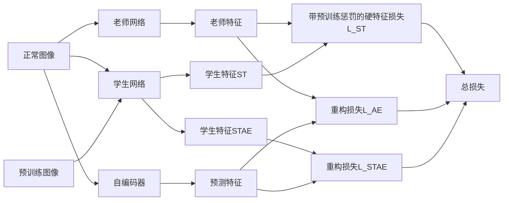
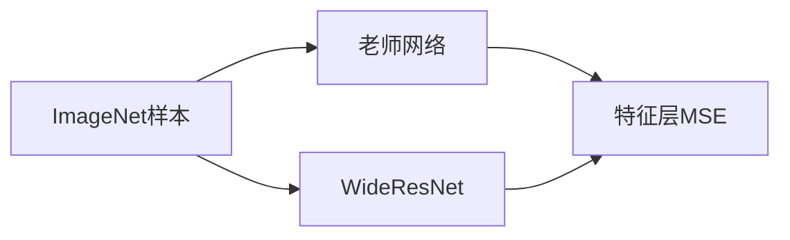
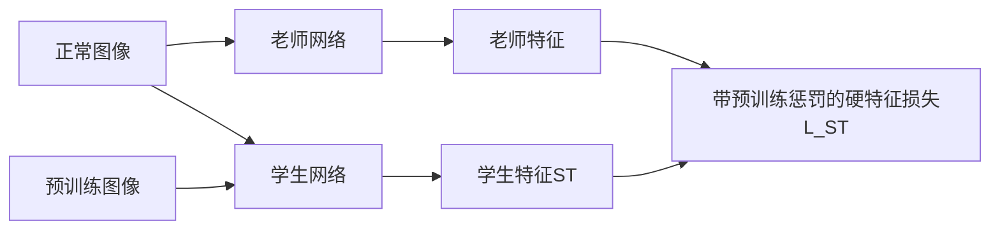
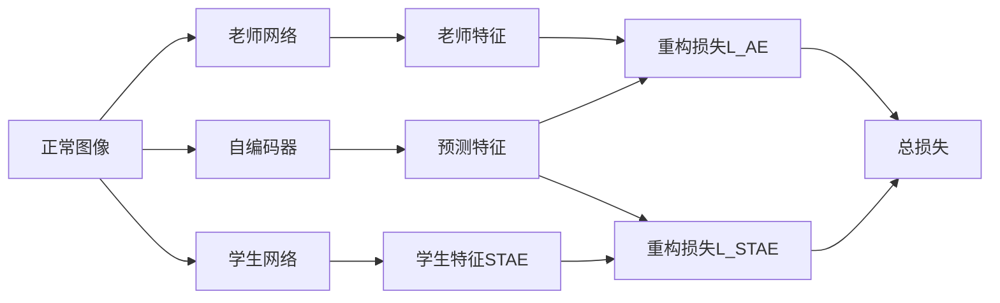
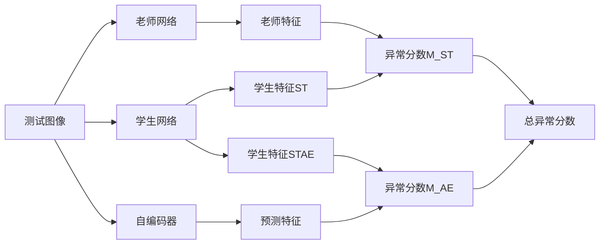

## 模型特点

EfficientAD是一个基于S-T（学生-老师）框架的异常检测方法，由Batzner等人在2024年提出。通过在训练时让学生网络学习老师网络在正常样本上的特征，然后测试时利用异常样本在学生网络和老师网络提取特征的差异实现异常检测。

- 提出了轻量级特征提取器PDN，大幅提高推理速度。
- 使用了S-T方法，提出了hard feature loss和预训练惩罚项，减少在训练数据分布以外的泛化性。通过阻止学生模型的泛化性，老师网络在所有图像上能正常提取特征，学生模型只会提取正常图像的特征，利用差异来检测异常。
- 利用自编码器实现逻辑异常检测。

## 模型架构

### PDN（Patch Description Network）

仅用四个卷积层组成。通常的S-T网络由于缺乏下采样和池化，因此计算成本很高。现代分类器结构通常在早期下采样，以减少特征图大小，从而降低运行时间和内存要求。

### S-T网络

- 老师和学生网络都使用PDN结构。
- 老师网络由WideResNet-101在ImageNet上蒸馏，通过最小化输出特征和预训练网络的特征之间的MSE来训练。

## 训练阶段

### 总体框架

### 蒸馏老师网络

首先需要训练教师网络，参考PatchNet，利用在ImageNet的预训练模型WideResNet-101中的特征提取器进行蒸馏。

预训练特征提取器为 $\Psi$，老师网络 $T$，用于蒸馏的预训练图像 $I_{dist}$。随机抽10000张图，计算 $\Psi(I_{dist})$ 在每个channel的均值方差用于归一化，令 $\hat{\Psi}(I_{dist})$ 为归一化后的特征，则蒸馏损失为：

$$L_{dist} = \frac{1}{HWC}\|\hat{\Psi}(I_{dist})-T(I_{dist})\|_2^2$$

### 训练学生网络和自编码器

首先是**S-T损失**，对于输出特征的每个元组 $(c,h,w)$，计算 $D_{c,w,h}=(T(I)_{c,w,h}-S(I)_{c,w,h})^2$。对于全部的 $D_{c,w,h}$，定义挖掘因子 $p_{hard}\in[0,1]$，然后只计算 $D$ 中超过 $p_{hard}$-分位数的元素。令 $D$ 中 $p_{hard}$-分位数对应的元素为 $d_{hard}$，于是训练损失 $L_{hard}$ 计算全部 $D_{c,w,h}\geq d_{hard}$ 的元素，即：

$$L_{hard}=\sum D_{c,w,h}[D_{c,w,h}\geq d_{hard}]$$

如果令 $p_{hard}$ 为0则是原始的S-T损失，在消融实验后选择 $p_{hard}$ 为0.999。为了进一步阻碍学生网络在分布外的正常图像上模仿老师网络，额外添加了惩罚项。在每次迭代时随机从预训练数据集采样图像 $P$，最后的S-T损失为：

$$L_{ST}=L_{hard}+\frac{1}{CWH}\sum_C\|S(P)_C\|_F^2$$

然后是**逻辑异常损失**，参考MVTec LOCO作者建议的，使用一个自编码器来训练图像的逻辑约束来检测异常，例如缺失、位置错误或违反几何约束。对于训练图像 $I$，自编码器用于预测老师网络的特征，重构损失为：

$$L_{AE}=\frac{1}{CWH}\sum_C\|T(I)_C-A(I)_C\|_F^2$$

由于自编码器的编码器和解码器通过64隐层维度的瓶颈，因此重建会存在缺陷，这会导致检测存在假阳。为此我们让学生网络额外输出特征 $S'(I)$，让学生网络学习自编码器在正常图像上的重建误差，而不学习异常图像的重建误差，损失函数为：

$$L_{STAE}=\frac{1}{CWH}\sum_C\|S'(I)_C-A(I)_C\|_F^2$$

于是训练阶段的总损失为：

$$L_{total}=L_{ST}+L_{AE}+L_{STAE}$$

## 测试阶段

我们用两个输出之间的平方差计算异常图，将自编码器和学生输出生成的异常图称为全局异常图，老师和学生输出生成的异常图称为局部异常图。将这两个异常图平均得到组合异常图，然后其最大值作为图像的异常分数。对于测试图像 $I_{test}$，异常分数为：

$$\begin{aligned}
M_{ST}&=(T(I_{test})-S(I_{test}))^2 \\
M_{AE}&=(A(I_{test})-S'(I_{test}))^2 \\
M &= 0.5M_{ST}+0.5M_{AE} \\
m_{image}&=\max_{i,j}M_{i,j}
\end{aligned}$$

然后就能得到异常图和异常分数，实际计算中还要考虑异常图的归一化。
