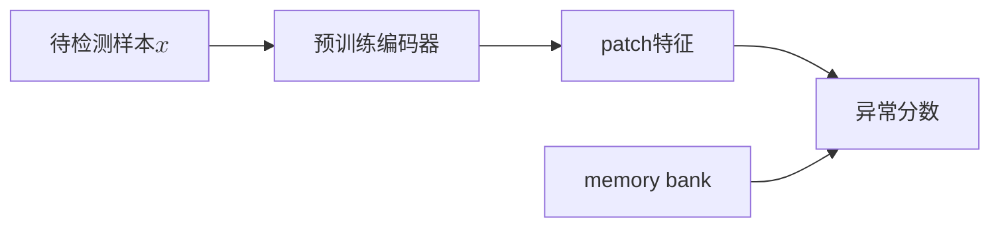
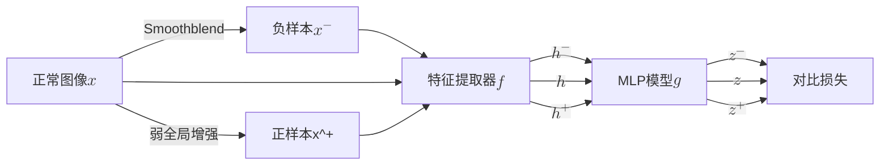
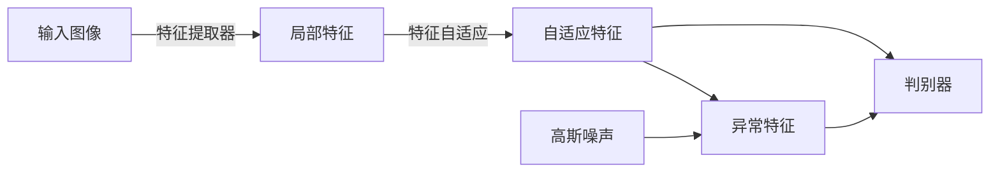
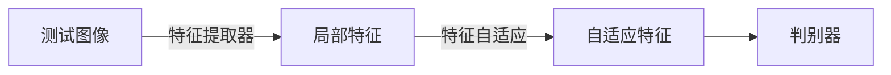
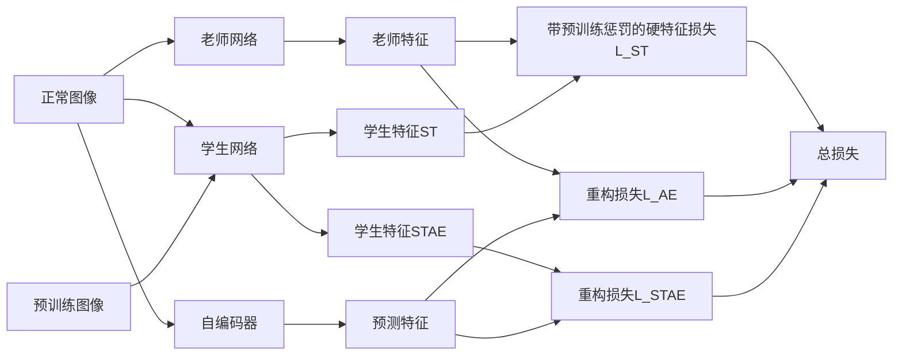
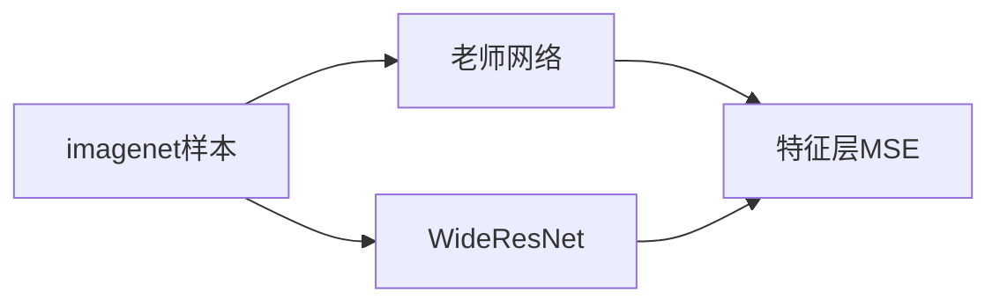
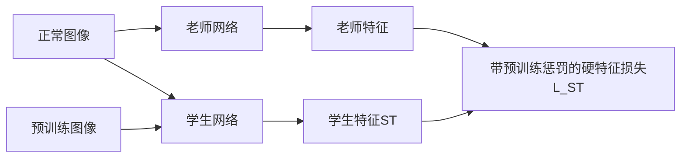
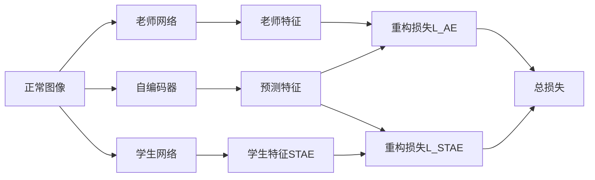
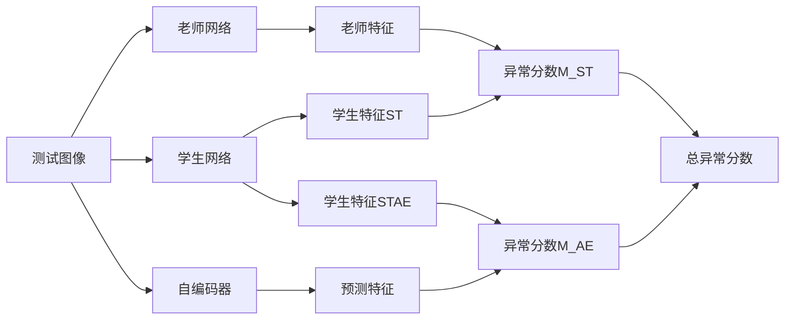

根据[这篇综述](https://github.com/M-3LAB/awesome-industrial-anomaly-detection)，无监督异常检测从特征嵌入分类有
- Teacher-student
- One-Class Classification
- Distribution
- Memory bank
这里我们稍微介绍其中的标志工作

|  年份   | 模型  |
|  ----  | ----  |
| 2022  | PatchCore |
||SPD|
| 2023  | SimpleNet |
| 2024  | EfficientAD |

# PatchCore
## 模型特点
PatchCore是一个基于memory bank的异常检测方法，由Roth等人在2022年提出。PatchCore的核心思想是将图像划分为多个小块（patch），并在每个小块上进行异常检测，从而提高了异常检测的精度。
- 参考了SPADE利用从预训练网络中提取的正常特征的memory bank，PatchCore也使用memory bank，但采用了一种基于邻域的补丁级特征，保留了更多的上下文并纳入了更好的适应性偏差。
    
- 为了接近memory bank特征空间的覆盖，文章为PatchCore调整贪婪算法得到coreset。

- PatchCore利用局部感知的patch特征分数来考虑局部空间变化，并减少对ImageNet类别的bias。

## 训练阶段

### 构造memory bank
定义 $\mathcal{N}_p^{(h,w)}$ 为在位置 $(h,w)$ 的大小为p的领域。$\phi_{i,j}=\phi_j(x_i)$为图像$x_i$在预训练网络$j$层的特征。于是在$(h,w)$的局部感知特征定义为
$$\phi_{i,j}(\mathcal{N}_p^{(h,w)}) = f_{agg}(\{\phi_{i,j}(a,b)|(a,b)\in\mathcal{N}_p^{(h,w)}\})$$
在PatchCore中，$f_{agg}$是自适应平均池化函数。加上步长参数$s$，局部感知特征集合为
$$\mathcal{P}_{s,p}(\phi_{i,j}) = \{\phi_{i,j}(\mathcal{N}_p^{(h,w)})|h,w\mod s=0,h<h^*,w<w^*\}$$
步长一般是1，在消融实验有别的步长。通过输入全部的正常样本，PatchCore Memory Bank $\mathcal{M}$定义为
$$\mathcal{M} = \bigcup_{x_i\in\mathcal{X}}\mathcal{P}_{s,p}(\phi_{j}(x_i))$$

### 采样coreset
随着 $\mathcal{X}$增加，memory bank $\mathcal{X}$会迅速增大，Coreset采样是为了寻找一个子集$\mathcal{S}\sub\mathcal{A}$，使得在$\mathcal{A}$上的问题能通过在$\mathcal{S}$上计算来快速估计。Coreset的选择如下
$$
\mathcal{M}^*_C=\argmin_{\mathcal{M}_C\sub\mathcal{M}} \max_{m\in\mathcal{M}} \min_{n\in\mathcal{M}_C} \|m-n\|_2
$$
可知就是选择$\mathcal{M}^*_C$使得和$\mathcal{M}$的hausdoff距离尽量小，在文章中使用了Johnson-Lindenstrauss 方法。

## 测试阶段

对于待检测样本 $x_{test}$，我们用同样的预训练网络获得局部感知特征集合 $\mathcal{P}(x_{test})=\mathcal{P}_{s,p}(\phi_j(x_{test}))$，然后将其与memory bank $\mathcal{M}$ 中的特征进行比较计算hausdoff距离。
$$
m^{test,*},m^*=\argmax_{m^{test}\in\mathcal{P}(x_{test})} \argmin_{m\in\mathcal{M}} \|m^{test}-m\|_2
$$
距离为
$$
s^*=\|m^{test,*}-m^*\|_2
$$
为了获得 $s$我们使用放缩$w$来考虑相邻样本的行为，如果memory bank中离待测特征$m^{test,*}$ 最近的特征 $m^*$，离其邻居距离很远，说明是个稀少样本，因此要增加异常分数
$$
s=(1-\frac{\exp\|m^{test,*}-m^*\|_2}{\Sigma_{m\in\mathcal{N}_b(m^*)}\exp\|m^{test,*}-m\|_2})s^*
$$
其中 $\mathcal{N}_b(m^*)$为 $\mathcal{M}$ 中离 $m^*$ 最近的 $b$ 个特征。

在计算异常分数后可以得到分割图，但是特征分辨率可能小于原始分辨率，直接使用双线性插值放大到原始分辨率。最后使用阈值分割得到异常区域。

<<<<<<< HEAD
# SPD
## 模型特点
SPD(SPot-the-difference) 是一个数据增强方案，由Zou等人在2022年提出。文章主要提出了SPD训练方法，和VisA数据集。

## 训练阶段

首先对输入图像$x$，使用全局增强，例如随机裁剪，高斯模糊，水平反转，颜色抖动，得到若增强正样本$x^+$，然后在全局增强的基础上应用smoothblend算法获得负样本$x^-$，具体是将图像的随机切割块进行颜色抖动，然后高斯模糊，再粘贴到同一图像的随机位置。然后通过特征提取器$f$得到$h$,$h^+$,$h^-$，在经过MLP $g$得到投影$z$,$z^+$,$z^-$。我们利用余弦相似度来衡量相关性，于是损失为
$$
L_{SPD}=\cos(z,z^-)-\cos(z,z^+)
$$
可以将SPD损失直接作为正则项加在常规自监督学习方法里。

## SimpleNet
=======
# SimpleNet
>>>>>>> refs/remotes/origin/main
## 模型特点
SimpleNet是一个基于特征分类的无异常检测方法，由Liu等人在2023年提出。SimpleNet使用了一个特征适应器来对齐预训练数据和训练数据，并且利用特征而不是样本来训练判别器，从而有更高的计算效率。

## 训练模型

训练过程由四部分组成
- 提取特征
- 对齐特征
- 通过对正样本特征加噪声获得负样本特征
- 从特征进行判别

**特征提取**部分使用预训练模型，然后参考了patchcore的局部感知patch特征，使用中间层级的特征来减少预训练数据的bias。具体的，先选择层级index$\{l\}$，然后计算每张图$x_i$在$l$的局部patch特征
$$z^{l,i}(h,w) = f_{agg}(\{\phi_{i,l}(a,b)|(a,b)\in\mathcal{N}_p^{(h,w)}\})$$
再统一线性插值到$(H_0,W_0)$大小得到$o^{l,i}$。然后cat全部$l$层得到$o^i$
$$
o^i=cat(resize(z^{l',i},(H_0,W_0)))|l'\in L
$$

**特征适应**部分使用了一个MLP，经过实验单层全连接层$G_\theta$已经有足够好的效果。
$$
q^i=G_\theta(o^i)
$$

**异常特征**通过给对齐后的特征$q^i$加上早上来生成异常特征$q^{i-}$，令$\epsilon$为高斯噪声，则异常特征为
$$
q^{i-}=q^{i}+\epsilon
$$

**判别器**$D_\psi$使用了2层MLP，不同于一般GAN模型使用的交叉熵，这里使用了截断$l_1$损失
$$
L^i=\max(0,0.5-D_\psi(q^i))+\max(0,-0.5+D_\psi(q^{i-}))
$$
最后的损失为
$$
L=\min_{\theta,\psi}\Sigma_{x^i\in\mathcal{X_{train}}}\Sigma_{h,w}\frac{L^i_{h,w}}{H_0\times W_0}
$$

## 测试阶段

于是测试图像$x^i$的异常分数为
$$
s^i=-D_\psi(q^i)
$$
取最大值作为图像的异常分数
$$
s_{image}=\max_{h,w} s^i_{h,w}
$$

# EfficientAD
## 模型特点
EfficientAD是一个基于S-T（学生-老师）框架的异常检测方法，由Batzner等人在2024年提出。通过在训练时让学生网络学习老师网络在正常样本上的特征，然后测试时利用异常样本在学生网络和老师网络提取特征的差异实现异常检测。    
- 提出了轻量级特征提取器PDN，大幅提高推理速度。
- 使用了S-T方法，提出了hard feature loss和预训练惩罚项，减少在训练数据分布以外的泛化性。通过阻止学生模型的泛化性，老师网络在所有图像上能正常提取特征，学生模型只会提取正常图像的特征，利用差异来检测异常。
- 利用自编码器实现逻辑异常检测。

## 模型架构

### PDN（patch discription network）
仅用四个卷积层组成。通常的S-T网络由于缺乏下采样和池化，因此计算成本很高。现代分类器结构通常在早期下采样，以减少特征图大小，从而降低运行时间和内存要求。

### S-T网络
- 老师和学生网络都使用PDN结构。
- 老师网络由WideResNet-101在imagenet上蒸馏，通过最小化输出特征和预训练网络的特征之间的MSE来训练。

## 训练阶段
### 总体框架

### 蒸馏老师网络

首先需要训练教师网络，参考PatchNet，利用在imagenet的预训练模型WideResNet-101中的特征提取器进行蒸馏。

预训练特征提取器为$\Psi$，老师网络$T$，用于蒸馏的预训练图像$I_{dist}$。随机抽10000张图，计算$\Psi(I_{dist})$在每个channel的均值方差用于归一化，令$\hat\Psi(I_{dist})$为归一化后的特征，则蒸馏损失为
$$
L_{dist} = \frac1{HWC}\|\hat\Psi(I_{dist})-T(I_{dist})\|_2^2$$

### 训练学生网络和自编码器

首先是**S-T损失**，对于输出特征的每个元组$(c,h,w)$，计算$D_{c,w,h}=(T(I)_{c,w,h}-S(I)_{c,w,h})^2$。对于全部的$D_{c,w,h}$，定义挖掘因子$p_{hard}\in[0,1]$，然后只计算$D$中超过$p_{hard}$-分位数的元素。令$D$中$p_{hard}$-分位数对应的元素为$d_{hard}$，于是训练损失$L_{hard}$计算全部$D_{c,w,h}\geq d_{hard}$的元素，即
$$
L_{hard}=\Sigma D_{c,w,h}[D_{c,w,h}\geq d_{hard}]
$$
如果令$p_{hard}$为0则是原始的S-T损失，在消融实验后选择$p_{hard}$为0.999。为了进一步阻碍学生网络在分布外的正常图像上模仿老师网络，额外添加了惩罚项。在每次迭代时随机从预训练数据集采样图像$P$，最后的S-T损失为
$$
L_{ST}=F_{hard}+\frac1{CWH}\Sigma_C\|S(P)_C\|_F^2
$$

然后是**逻辑异常损失**，参考MVTec LOCO作者建议的，使用一个自编码器来训练图像的逻辑约束来检测异常，例如缺失、位置错误或违反几何约束。对于训练图像$I$，自编码器用于预测老师网络的特征，重构损失为
$$
L_{AE}=\frac1{CWH}\Sigma_C\|T(I)_C-A(I)_C\|_F^2
$$

由于自编码器的编码器和解码器通过64隐层维度的瓶颈，因此重建会存在缺陷，这会导致检测存在假阳。为此我们让学生网络额外输出特征$S'(I)$，让学生网络学习自编码器在正常图像上的重建误差，而不学习异常图像的重建误差，损失函数为
$$
L_{STAE}=\frac1{CWH}\Sigma_C\|S'(I)_C-A(I)_C\|_F^2
$$
于是训练阶段的总损失为
$$
L_{total}=L_{ST}+L{AE}+L_{STAE}
$$

## 测试阶段

我们用两个输出之间的平方差计算异常图，将自编码器和学生输出生成的异常图称为全局异常图，老师和学生输出生成的异常图称为局部异常图。将这两个异常图平均得到组合异常图，然后其最大值作为图像的异常分数。对于测试图像$I_{test}$，异常分数为
$$
\begin{aligned}
M_{ST}&=(T(I_{test})-S(I_{test}))^2 \\
M_{AE}&=(A(I_{test})-S'(I_{test}))^2 \\
M &= 0.5M_{ST}+0.5M_{AE} \\
m_{image}&=\max_{i,j}M_{i,j}
\end{aligned}
$$
然后就能得到异常图和异常分数，实际计算中还要考虑异常图的归一化。

