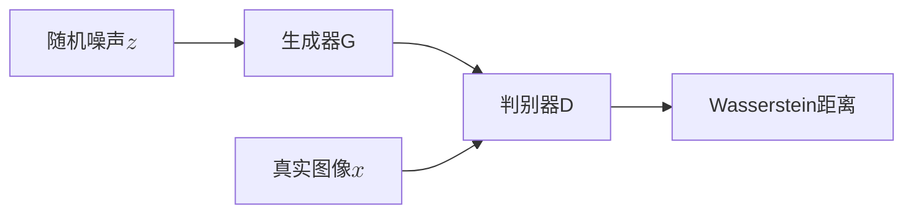
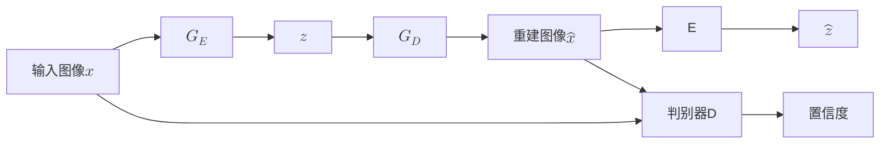
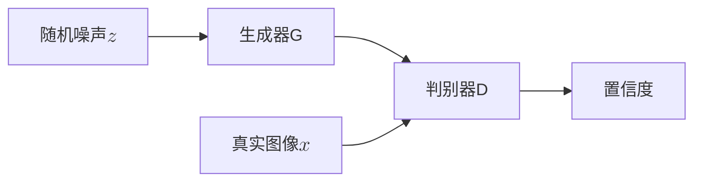
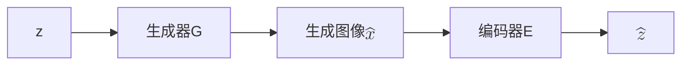
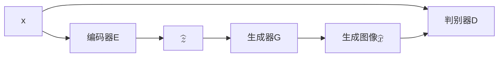

# WGAN

## 模型特点

WGAN（Wasserstein GAN）是由Arjovsky等人在2017年提出的，它通过引入Wasserstein距离来解决GAN训练中的不稳定性问题。WGAN的核心思想是使用一个新的损失函数来衡量生成样本和真实样本之间的距离，从而使得训练更加稳定。

## 训练阶段

训练阶段与DCGAN类似，但WGAN使用Wasserstein距离作为损失函数。在作者通过公式变换后，优化目标为：

$$\underset{G}\min \underset{D\in\mathcal{D}}\max  \mathbb{E}_{x \sim p_{data}(x)}[D(x)] - \mathbb{E}_{z \sim p_{noise}(z)}[D(G(z))]$$

其中，$\mathcal{D}$是所有1-Lipschitz函数的集合。WGAN通过对判别器进行权重裁剪（weight clipping）来保证其满足1-Lipschitz条件。

这里可以看出WGAN和GAN在判别器设计上的差别，GAN的判别器输出一个概率值，希望真实图像接近1，生成图像接近0。而WGAN的判别器输出一个实数值，表示生成图像和真实图像分布之间的距离。

# WGAN-GP

## 模型特点
WGAN-GP（Wasserstein GAN with Gradient Penalty）是WGAN的改进版本，由Gulrajani等人在2017年提出。它通过引入梯度惩罚（Gradient Penalty）来替代权重裁剪，从而进一步提高了训练的稳定性。

## 训练阶段

训练阶段与WGAN类似，但WGAN-GP在损失函数中加入了梯度惩罚项，以确保判别器的梯度满足Lipschitz条件。优化目标为：
$$\underset{G}\min \underset{D}\max  \mathbb{E}_{x \sim p_{data}(x)}[D(x)] - \mathbb{E}_{z \sim p_{noise}(z)}[D(G(z))] + \lambda \mathbb{E}_{\hat{x} \sim p_{\hat{x}}(\hat{x})}[(||\nabla D(\hat{x})||_2 - 1)^2]$$

其中$\hat{x}=\epsilon x+(1-\epsilon)G(z)$，$\epsilon\sim U[0,1]$，$\lambda$是梯度惩罚的系数。

# GANomaly

## 模型特点
GANomaly是一个基于GAN的异常检测方法，由Akcay等人在2018年提出。它通过训练一个生成对抗网络来学习正常样本的分布，并使用重建误差来检测异常样本。为了减少AnoGAN的测试时间，GANomaly引入了一个编码器来将输入图像映射到隐空间，从而加快了异常检测的速度。

## 训练阶段

训练阶段包括两个生成器：编码器$G_E$和解码器$G_D$。编码器将输入图像$x$转换为隐空间表示$z$，解码器将隐空间表示转换为重建图像$\hat x=G_D(z)$。判别器D用于判断输入图像$x$和重建图像$\hat x$的差异。

判别器的损失函数跟DCGAN类似，优化目标为：
$$\underset{D}\max  \mathbb{E}_{x \sim p_{data}(x)}[\log D(x) + \log(1 - D(G_D(G_E(x))))]$$

生成器的损失函数由三个部分组成，我们令$f(\cdot)$为判别器D的中间层输出，则对抗损失为
$$L_{adv} = \mathbb{E}_{x \sim p_{data}(x)}\|f(x)-f(G(x))\|_2$$

为了度量输入图像和生成图像间的距离，重建损失为
$$L_{con} = \mathbb{E}_{x \sim p_{data}(x)}\|x-G(x)\|_1$$

虽然上面两个损失已经够用了，但为了进一步提高生成图像的质量，GANomaly还引入了编码损失。编码损失度量了编码器输出的隐空间表示$G_E(x)$和解码器对生成图像$G(x)$的编码结果$E(G(x))$之间的差异。编码损失为

$$L_{enc} = \mathbb{E}_{x \sim p_{data}(x)}\|G_E(x)-E(G(x))\|_2$$

最终的生成器损失函数为
$$L = w_{adv}L_{adv} + w_{con} L_{con} + w_{enc} L_{enc}$$

## 测试阶段

在测试阶段使用编码损失$L_{enc}$来检测异常样本，对于测试样本$\hat x$，异常分数定义为

$$A(\hat x) = \|G_E(\hat x)-E(G(\hat x))\|_1$$

# f-AnoGAN

## 模型特点
f-AnoGAN是AnoGAN的改进版本，它通过引入编码器来加速寻找最优编码的过程。并使用了WGAN的Wasserstein距离作为损失函数，从而提高了训练的稳定性。

## 训练阶段

训练分为两个阶段，第一个阶段是训练生成器G和判别器D，与DCGAN类似，但f-AnoGAN使用Wasserstein距离作为损失函数。优化目标为：

$$\underset{G}\min \underset{D}\max  \mathbb{E}_{x \sim p_{data}(x)}[D(x)] - \mathbb{E}_{z \sim p_{noise}(z)}[D(G(z))] + \lambda \mathbb{E}_{\hat{x} \sim p_{\hat{x}}(\hat{x})}[(||\nabla D(\hat{x})||_2 - 1)^2]$$

其中$\hat{x}=\epsilon x+(1-\epsilon)G(z)$，$\epsilon\sim U[0,1]$，$\lambda$是梯度惩罚的系数。通过训练我们得到一个生成器$G(z)=z\mapsto x$将$\mathcal{Z}$映射到$\mathcal{X}$，但我们没有从$\mathcal{X}$到$\mathcal{Z}$的逆映射。因此通过训练一个编码器来学习映射$E(x)=x\mapsto z$。编码器可以通过两种结构进行训练
- z-image-z（ziz）编码器训练
- image-z-image（izi）编码器训练

### ziz编码器训练

在训练过程中，从z空间抽取的样本通过生成器映射到图像空间，然后编码器E学习将其映射回z空间。对于ziz编码器的训练不需要图像数据，结构类似于z-to-z的自编码器。损失函数为
$$L_{ziz} = \frac1d\|E(G(z))-z\|^2_2$$
d为z空间的维度。这种方法的好处是不需要图像数据，但缺点是编码器没接受过真实数据。

### izi编码器训练

izi编码器的训练需要图像数据，编码器E将输入图像$x$映射到隐空间表示$\hat z$，然后生成器G将$\hat z$映射回图像空间得到重建图像$\hat x$。损失函数为
$$L_{izi} = \frac1n\|x-G(E(x))\|^2_2 $$
n为像素数量。这种方法可以在训练数据上得到比较好的效果。但是由于没有限制z空间，因此可能会导致在z空间上分布稀疏，影响在真实场景中的鲁棒性。我们发现判别器的中间层可以很好的表示特征空间，因此我们提出了判别器引导的izi编码器训练（$izi_f$）架构。损失函数为
$$L_{izi_f} = \frac1n\|x-G(E(x))\|^2_2 + \frac{k}{n_d}\|f(x)-f(G(E(x)))\|^2_2$$
$f(\cdot)$为判别器的中间层表示，$n_d$为判别器中间层的维度，$k$为权重系数。在f-AnoGAN中选择了$izi_f$编码器训练架构。

## 测试阶段

对异常的量化参照$izi_f$架构，一张图像$x$的异常分数$\mathcal{A}(x)$定义为
$$\mathcal{A}(x) = \|E(x)-E(G(E(x)))\|^2_2 + \frac{k}{n_d}\|f(x)-f(G(E(x)))\|^2_2$$

还有另一种方法是仅使用训练好的WGAN判别器进行评价。与DCGAN不同，判别器输出了图像真实性的度量，而WGAN计算的是和生成图像和真实图像之间的距离。因此对于没见过的图像$x_u$，异常值评分为
$$A_D(x_u) = \mathbb{E}_{x_t\sim P_r}[D(x_t)]-D(x_u)$$
其中第一项的期望选择了32000张随机抽取的训练图像计算。
