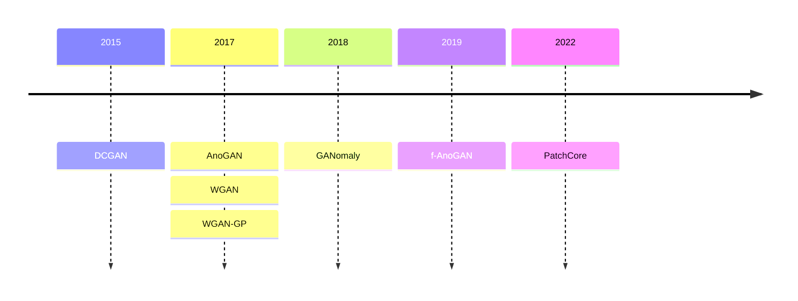
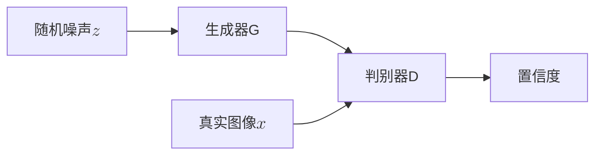
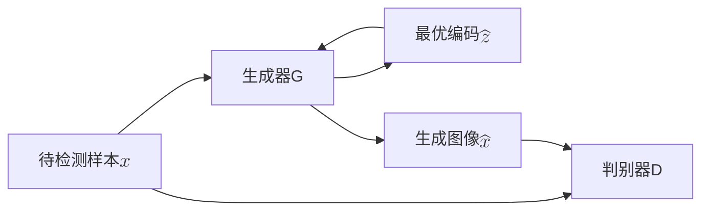
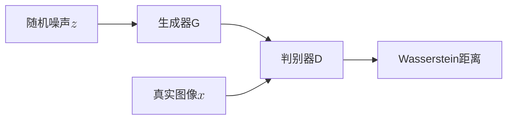
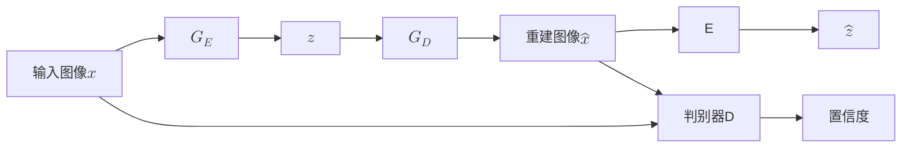
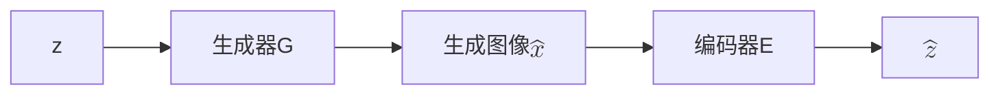
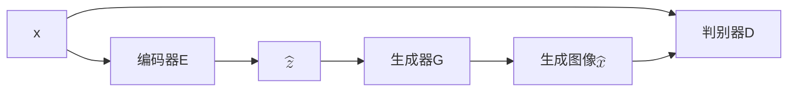
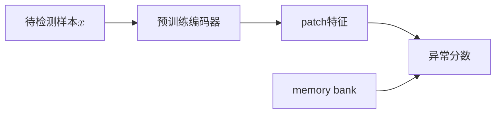

这份报告主要调研了目前比较新或经典的异常检测方法，会先以2019年的f-AnoGAN为界介绍一些其设计来源的老方法，然后再开始按时间线介绍最近的新论文。

# DCGAN

## 模型特点
在DCGAN中首次提出了反卷积（Deconvolution，转置卷积）层，这种层可以将低维特征图转换为高维图像。DCGAN还引入了批归一化（Batch Normalization）和ReLU激活函数，使得训练更加稳定。此外，DCGAN使用了全卷积网络结构，避免了全连接层的使用，从而减少了参数数量。

## 训练阶段 

整体结构如上图所示，模型由一个生成器和一个判别器组成。在DCGAN中生成器和判别器都是CNN结构，生成器通过反卷积层将随机噪声$z$转换为图像，而判别器则通过卷积层对输入图像进行分类，判断其是真实图像还是生成图像。

判别器会给出一个置信度值，表示输入图像是真实图像的概率。我们希望真实图像接近1，生成图像接近0，因此优化目标为

$$\underset{G}\min \underset{D}\max  \mathbb{E}_{x \sim p_{data}(x)}[\log D(x)] + \mathbb{E}_{z \sim p_{noise}(z)}[\log(1 - D(G(z)))]$$

在训练时我们先抽取真实图像，在抽取同样数量的随机噪声$z\in N(0,1)$，交替训练生成器G和判别器D直到收敛。

# AnoGAN

## 模型特点
AnoGAN是一个基于GAN的异常检测方法，最早由Schlegl等人在2017年提出。它的核心思想是通过训练一个生成对抗网络（GAN）来学习正常样本的分布，从而能够检测出异常样本。

## 训练阶段

训练阶段跟DCGAN一致，优化的目标函数为

$$\underset{G}\min \underset{D}\max  \mathbb{E}_{x \sim p_{data}(x)}[\log D(x)] + \mathbb{E}_{z \sim p_{noise}(z)}[\log(1 - D(G(z)))]$$

## 测试阶段

对于待检测的样本$x$，我们固定生成器G，希望找到$\hat z$使得生成图像$\hat x = G(\hat z)$与原图像$x$之间的差异最小，我们使用反向传播来获得$\hat z$。为了在隐空间上足够接近，设计的损失函数由残差损失和判别损失组成。

残差损失度量了原图$x$和生成图像$G(\hat{x})$的视觉相似性，这里定义为

$$L_{res}(\hat{z}) = ||x - G(\hat{z})||_1$$

对于图像修复，可以将生成图像$G(\hat{x})$丢入判别器使得$D(G(\hat{x}))$尽可能接近1。在这篇文章中，作者通过特征匹配来改进判别损失，这使得生成图像和原图在特征空间上更接近。令$f(\cdot)$为判别器中间层的特征，则判别损失定义为

$$L_{disc}(\hat{z}) = ||f(x) - f(G(\hat{z}))||_1$$

最后我们将两部分损失结合起来，得到最终的优化目标函数

$$L(\hat{z}) = (1-\lambda)L_{res}(\hat{z}) + \lambda L_{disc}(\hat{z})$$

在这篇文章中$\lambda$取了0.1，在通过迭代优化得到最优编码$\hat{z}$后，生成图像$G(\hat{z})$与原图像$x$的差异越大，则认为该样本是异常的。

# WGAN

## 模型特点

WGAN（Wasserstein GAN）是由Arjovsky等人在2017年提出的，它通过引入Wasserstein距离来解决GAN训练中的不稳定性问题。WGAN的核心思想是使用一个新的损失函数来衡量生成样本和真实样本之间的距离，从而使得训练更加稳定。

## 训练阶段

训练阶段与DCGAN类似，但WGAN使用Wasserstein距离作为损失函数。在作者通过公式变换后，优化目标为：

$$\underset{G}\min \underset{D\in\mathcal{D}}\max  \mathbb{E}_{x \sim p_{data}(x)}[D(x)] - \mathbb{E}_{z \sim p_{noise}(z)}[D(G(z))]$$

其中，$\mathcal{D}$是所有1-Lipschitz函数的集合。WGAN通过对判别器进行权重裁剪（weight clipping）来保证其满足1-Lipschitz条件。

这里可以看出WGAN和GAN在判别器设计上的差别，GAN的判别器输出一个概率值，希望真实图像接近1，生成图像接近0。而WGAN的判别器输出一个实数值，表示生成图像和真实图像分布之间的距离。

测试阶段在后面用到的模型用介绍。

# WGAN-GP

## 模型特点
WGAN-GP（Wasserstein GAN with Gradient Penalty）是WGAN的改进版本，由Gulrajani等人在2017年提出。它通过引入梯度惩罚（Gradient Penalty）来替代权重裁剪，从而进一步提高了训练的稳定性。

## 训练阶段

训练阶段与WGAN类似，但WGAN-GP在损失函数中加入了梯度惩罚项，以确保判别器的梯度满足Lipschitz条件。优化目标为：
$$\underset{G}\min \underset{D}\max  \mathbb{E}_{x \sim p_{data}(x)}[D(x)] - \mathbb{E}_{z \sim p_{noise}(z)}[D(G(z))] + \lambda \mathbb{E}_{\hat{x} \sim p_{\hat{x}}(\hat{x})}[\|\nabla D(\hat{x})\|_2 - 1]^2$$

其中$\hat{x}=\epsilon x+(1-\epsilon)G(z)$，$\epsilon\sim U[0,1]$，$\lambda$是梯度惩罚的系数。

# GANomaly

## 模型特点
GANomaly是一个基于GAN的异常检测方法，由Akcay等人在2018年提出。它通过训练一个生成对抗网络来学习正常样本的分布，并使用重建误差来检测异常样本。为了减少AnoGAN在测试时需要反向传播找$\hat z$的时间，GANomaly引入了一个编码器来将输入图像映射到隐空间，从而加快了异常检测的速度。

## 训练阶段

训练阶段包括两个生成器：编码器$G_E$和解码器$G_D$。编码器将输入图像$x$转换为隐空间表示$z$，解码器将隐空间表示转换为重建图像$\hat x=G_D(z)$。判别器D用于判断输入图像$x$和重建图像$\hat x$的差异。

**判别器**的损失函数跟DCGAN类似，优化目标为：
$$\underset{D}\max  \mathbb{E}_{x \sim p_{data}(x)}[\log D(x) + \log(1 - D(G(x)))]$$

**生成器**的损失函数由三个部分组成，我们令$f(\cdot)$为判别器D的中间层输出，则对抗损失为
$$L_{adv} = \mathbb{E}_{x \sim p_{data}(x)}\|f(x)-f(G(x))\|_2$$

为了度量输入图像和生成图像间的距离，重建损失为
$$L_{con} = \mathbb{E}_{x \sim p_{data}(x)}\|x-G(x)\|_1$$

虽然上面两个损失已经够用了，但为了进一步提高生成图像的质量，GANomaly还引入了编码损失。编码损失度量了编码器输出的隐空间表示$G_E(x)$和解码器对生成图像$G(x)$的编码结果$E(G(x))$之间的差异。编码损失为

$$L_{enc} = \mathbb{E}_{x \sim p_{data}(x)}\|G_E(x)-E(G(x))\|_2$$

最终的生成器损失函数为
$$L = w_{adv}L_{adv} + w_{con} L_{con} + w_{enc} L_{enc}$$

## 测试阶段

在测试阶段使用编码损失$L_{enc}$来检测异常样本，对于测试样本$\hat x$，异常分数定义为

$$A(\hat x) = \|G_E(\hat x)-E(G(\hat x))\|_1$$

# f-AnoGAN

## 模型特点
f-AnoGAN是AnoGAN的改进版本，它通过引入编码器来加速寻找最优编码的过程。并使用了WGAN的Wasserstein距离作为损失函数，从而提高了训练的稳定性。

## 训练阶段

训练分为两个阶段，第一个阶段是训练生成器G和判别器D，与DCGAN类似，但f-AnoGAN使用Wasserstein距离作为损失函数。优化目标为：

$$\underset{G}\min \underset{D}\max  \mathbb{E}_{x \sim p_{data}(x)}[D(x)] - \mathbb{E}_{z \sim p_{noise}(z)}[D(G(z))] + \lambda \mathbb{E}_{\hat{x} \sim p_{\hat{x}}(\hat{x})}[\|\nabla D(\hat{x})\|_2 - 1]^2$$

其中$\hat{x}=\epsilon x+(1-\epsilon)G(z)$，$\epsilon\sim U[0,1]$，$\lambda$是梯度惩罚的系数。通过训练我们得到一个生成器$G(z)=z\mapsto x$将$\mathcal{Z}$映射到$\mathcal{X}$，但我们没有从$\mathcal{X}$到$\mathcal{Z}$的逆映射。因此通过训练一个编码器来学习映射$E(x)=x\mapsto z$。编码器可以通过两种结构进行训练
- z-image-z（ziz）编码器训练
- image-z-image（izi）编码器训练

### ziz编码器训练

在训练过程中，从z空间抽取的样本通过生成器映射到图像空间，然后编码器E学习将其映射回z空间。ziz编码器的训练不需要图像数据，结构类似于z-to-z的自编码器。损失函数为
$$L_{ziz} = \frac1d\|E(G(z))-z\|^2_2$$
d为z空间的维度。这种方法的好处是不需要图像数据，但缺点是编码器没接受过真实数据。

### izi编码器训练

izi编码器的训练需要图像数据，编码器E将输入图像$x$映射到隐空间表示$\hat z$，然后生成器G将$\hat z$映射回图像空间得到重建图像$\hat x$。损失函数为
$$L_{izi} = \frac1n\|x-G(E(x))\|^2_2 $$
n为像素数量。这种方法可以在训练数据上得到比较好的效果。但是由于没有限制z空间，因此可能会导致在z空间上分布稀疏，影响在真实场景中的鲁棒性。我们发现判别器的中间层可以很好的表示特征空间，因此我们提出了判别器引导的izi编码器训练（$izi_f$）架构。损失函数为
$$L_{izi_f} = \frac1n\|x-G(E(x))\|^2_2 + \frac{k}{n_d}\|f(x)-f(G(E(x)))\|^2_2$$
$f(\cdot)$为判别器的中间层表示，$n_d$为判别器中间层的维度，$k$为权重系数。在f-AnoGAN中选择了$izi_f$编码器训练架构。

## 测试阶段

对异常的量化参照$izi_f$架构，一张图像$x$的异常分数$\mathcal{A}(x)$定义为
$$\mathcal{A}(x) = \|E(x)-E(G(E(x)))\|^2_2 + \frac{k}{n_d}\|f(x)-f(G(E(x)))\|^2_2$$

还有另一种方法是仅使用训练好的WGAN判别器进行评价。与DCGAN不同，判别器输出了图像真实性的度量，而WGAN计算的是和生成图像和真实图像之间的距离。因此对于没见过的图像$x_u$，异常值评分为
$$A_D(x_u) = \mathbb{E}_{x_t\sim P_r}[D(x_t)]-D(x_u)$$
其中第一项的期望选择了32000张随机抽取的训练图像计算。

# PatchCore
## 模型特点
PatchCore是一个基于GAN的异常检测方法，由Roth等人在2022年提出。PatchCore的核心思想是将图像划分为多个小块（patch），并在每个小块上进行异常检测，从而提高了异常检测的精度。
- 参考了SPADE利用从预训练网络中提取的正常特征的memory bank，PatchCore也使用memory bank，但采用了一种基于邻域的补丁级特征，保留了更多的上下文并纳入了更好的适应性偏差。
    
- 为了接近memory bank特征空间的覆盖，文章为PatchCore调整贪婪算法得到coreset。

- PatchCore利用局部感知的patch特征分数来考虑局部空间变化，并减少对ImageNet类别的bias。

## 训练阶段

### 构造memory bank
定义$\mathcal{N}_p^{(h,w)}$为在位置$(h,w)$的大小为p的领域。$\phi_{i,j}=\phi_j(x_i)$为图像$x_i$在预训练网络$j$层的特征。于是在$(h,w)$的局部感知特征定义为
$$\phi_{i,j}(\mathcal{N}_p^{(h,w)}) = f_{agg}(\{\phi_{i,j}(a,b)|(a,b)\in\mathcal{N}_p^{(h,w)}\})$$
在PatchCore中，$f_{agg}$是自适应平均池化函数。加上步长参数$s$，局部感知特征集合为
$$\mathcal{P}_{s,p}(\phi_{i,j}) = \{\phi_{i,j}(\mathcal{N}_p^{(h,w)})|h,w\mod s=0,h<h^*,w<w^*\}$$
步长一般是1，在消融实验有别的步长。通过输入全部的正常样本，PatchCore Memory Bank $\mathcal{M}$定义为
$$\mathcal{M} = \bigcup_{x_i\in\mathcal{X}}\mathcal{P}_{s,p}(\phi_{j}(x_i))$$

### 采样coreset
随着$\mathcal{X}$增加，memory bank $\mathcal{X}$会迅速增大，Coreset采样是为了寻找一个子集$\mathcal{S}\sub\mathcal{A}$，使得在$\mathcal{A}$上的问题能通过在$\mathcal{S}$上计算来快速估计。Coreset的选择如下
$$
\mathcal{M}^*_C=\argmin_{\mathcal{M}_C\sub\mathcal{M}} \max_{m\in\mathcal{M}} \min_{n\in\mathcal{M}_C} \|m-n\|_2
$$
可知就是选择$\mathcal{M}^*_C$使得和$\mathcal{M}$的hausdoff距离尽量小，在文章中使用了Johnson-Lindenstrauss 方法。

## 测试阶段

对于待检测样本$x_{test}$，我们用同样的预训练网络获得局部感知特征集合$\mathcal{P}(x_{test})=\mathcal{P}_{s,p}(\phi_j(x_{test}))$，然后将其与memory bank $\mathcal{M}$中的特征进行比较计算hausdoff距离。
$$
m^{test,*},m^*=\argmax_{m^{test}\in\mathcal{P}(x_{test})} \argmin_{m\in\mathcal{M}} \|m^{test}-m\|_2
$$
距离为
$$
s^*=\|m^{test,*}-m^*\|_2
$$
为了获得$s$我们使用放缩$w$来考虑相邻样本的行为，如果memory bank中离待测特征$m^{test,*}$ 最近的特征 $m^*$，离其邻居距离很远，说明是个稀少样本，因此要增加异常分数
$$
s=(1-\frac{\exp\|m^{test,*}-m^*\|_2}{\Sigma_{m\in\mathcal{N}_b(m^*)}\exp\|m^{test,*}-m\|_2})s^*
$$
其中$\mathcal{N}_b(m^*)$为$\mathcal{M}$中离$m^*$最近的$b$个特征。

在计算异常分数后可以得到分割图，但是特征分辨率可能小于原始分辨率，直接使用双线性插值放大到原始分辨率。最后使用阈值分割得到异常区域