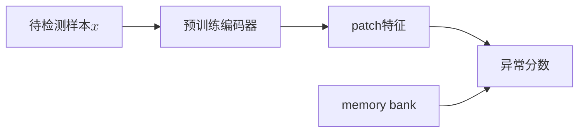

|  年份   | 模型  |
|  ----  | ----  |
| 2022 | PatchCore |

# PatchCore
## 模型特点
PatchCore是一个基于GAN的异常检测方法，由Roth等人在2022年提出。PatchCore的核心思想是将图像划分为多个小块（patch），并在每个小块上进行异常检测，从而提高了异常检测的精度。
- 参考了SPADE利用从预训练网络中提取的正常特征的memory bank，PatchCore也使用memory bank，但采用了一种基于邻域的补丁级特征，保留了更多的上下文并纳入了更好的适应性偏差。
    
- 为了接近memory bank特征空间的覆盖，文章为PatchCore调整贪婪算法得到coreset。

- PatchCore利用局部感知的patch特征分数来考虑局部空间变化，并减少对ImageNet类别的bias。

## 训练阶段

### 构造memory bank
定义$\mathcal{N}_p^{(h,w)}$为在位置$(h,w)$的大小为p的领域。$\phi_{i,j}=\phi_j(x_i)$为图像$x_i$在预训练网络$j$层的特征。于是在$(h,w)$的局部感知特征定义为
$$\phi_{i,j}(\mathcal{N}_p^{(h,w)}) = f_{agg}(\{\phi_{i,j}(a,b)|(a,b)\in\mathcal{N}_p^{(h,w)}\})$$
在PatchCore中，$f_{agg}$是自适应平均池化函数。加上步长参数$s$，局部感知特征集合为
$$\mathcal{P}_{s,p}(\phi_{i,j}) = \{\phi_{i,j}(\mathcal{N}_p^{(h,w)})|h,w\mod s=0,h<h^*,w<w^*\}$$
步长一般是1，在消融实验有别的步长。通过输入全部的正常样本，PatchCore Memory Bank $\mathcal{M}$定义为
$$\mathcal{M} = \bigcup_{x_i\in\mathcal{X}}\mathcal{P}_{s,p}(\phi_{j}(x_i))$$

### 采样coreset
随着$\mathcal{X}$增加，memory bank $\mathcal{X}$会迅速增大，Coreset采样是为了寻找一个子集$\mathcal{S}\sub\mathcal{A}$，使得在$\mathcal{A}$上的问题能通过在$\mathcal{S}$上计算来快速估计。Coreset的选择如下
$$
\mathcal{M}^*_C=\argmin_{\mathcal{M}_C\sub\mathcal{M}} \max_{m\in\mathcal{M}} \min_{n\in\mathcal{M}_C} \|m-n\|_2
$$
可知就是选择$\mathcal{M}^*_C$使得和$\mathcal{M}$的hausdoff距离尽量小，在文章中使用了Johnson-Lindenstrauss 方法。

## 测试阶段

对于待检测样本$x_{test}$，我们用同样的预训练网络获得局部感知特征集合$\mathcal{P}(x_{test})=\mathcal{P}_{s,p}(\phi_j(x_{test}))$，然后将其与memory bank $\mathcal{M}$中的特征进行比较计算hausdoff距离。
$$
m^{test,*},m^*=\argmax_{m^{test}\in\mathcal{P}(x_{test})} \argmin_{m\in\mathcal{M}} \|m^{test}-m\|_2
$$
距离为
$$
s^*=\|m^{test,*}-m^*\|_2
$$
为了获得$s$我们使用放缩$w$来考虑相邻样本的行为，如果memory bank中离待测特征$m^{test,*}$ 最近的特征 $m^*$，离其邻居距离很远，说明是个稀少样本，因此要增加异常分数
$$
s=(1-\frac{\exp\|m^{test,*}-m^*\|_2}{\Sigma_{m\in\mathcal{N}_b(m^*)}\exp\|m^{test,*}-m\|_2})s^*
$$
其中$\mathcal{N}_b(m^*)$为$\mathcal{M}$中离$m^*$最近的$b$个特征。

在计算异常分数后可以得到分割图，但是特征分辨率可能小于原始分辨率，直接使用双线性插值放大到原始分辨率。最后使用阈值分割得到异常区域

